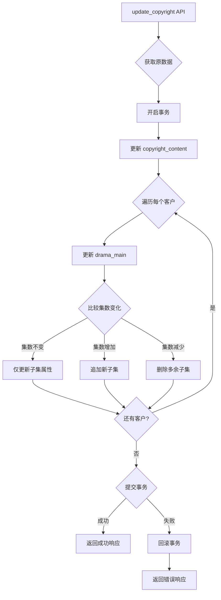

# Design Document: 版权更新优化

## Overview

本设计文档描述版权数据更新逻辑的优化方案，主要解决以下问题：
1. 子集全删全建导致的性能问题
2. 缺乏事务一致性保证
3. 逐条插入的低效问题

优化后的更新流程将实现增量更新、事务保护和批量操作，显著提升更新性能和数据一致性。

## Architecture



## Components and Interfaces

### 1. 增量更新模块

**函数签名：**
```python
def _update_episodes_incremental(
    cursor, 
    drama_id: int, 
    old_count: int, 
    new_count: int, 
    media_name: str, 
    data: dict, 
    customer_code: str
) -> dict:
    """
    增量更新子集数据
    
    Args:
        cursor: 数据库游标
        drama_id: 剧头ID
        old_count: 原集数
        new_count: 新集数
        media_name: 介质名称
        data: 版权数据
        customer_code: 客户代码
    
    Returns:
        dict: 包含 added, deleted, updated 数量的统计信息
    """
```

**处理逻辑：**
- `old_count == new_count`: 不操作子集表
- `old_count < new_count`: 批量追加 `new_count - old_count` 条子集
- `old_count > new_count`: 删除集数 > new_count 的子集

### 2. 子集属性更新模块

**函数签名：**
```python
def _update_episode_properties(
    cursor,
    drama_id: int,
    media_name: str,
    data: dict,
    customer_code: str
) -> int:
    """
    更新所有子集的动态属性（当介质名称变化时）
    
    Returns:
        int: 更新的子集数量
    """
```

### 3. 批量插入模块

**函数签名：**
```python
def _batch_create_episodes(
    cursor,
    drama_id: int,
    media_name: str,
    start_episode: int,
    end_episode: int,
    data: dict,
    customer_code: str
) -> int:
    """
    批量创建子集数据
    
    Args:
        start_episode: 起始集数（包含）
        end_episode: 结束集数（包含）
    
    Returns:
        int: 创建的子集数量
    """
```

### 4. 事务管理

使用 Python 的 context manager 模式管理事务：

```python
def update_copyright(item_id: int, data: Dict[str, Any]):
    with get_db() as conn:
        try:
            cursor = conn.cursor(pymysql.cursors.DictCursor)
            # ... 所有更新操作 ...
            conn.commit()
            return success_response
        except Exception as e:
            conn.rollback()
            raise HTTPException(status_code=500, detail=str(e))
```

## Data Models

### 现有表结构（无需修改）

```sql
-- 版权方数据表
copyright_content (
    id, media_name, episode_count, drama_ids, ...
)

-- 剧头表
drama_main (
    drama_id, customer_code, drama_name, dynamic_properties
)

-- 子集表
drama_episode (
    episode_id, drama_id, episode_name, dynamic_properties
)
```

### 子集查询优化

为支持增量更新，需要能够：
1. 查询指定 drama_id 的当前子集数量
2. 按集数范围删除子集
3. 批量插入子集

```sql
-- 获取当前子集数量
SELECT COUNT(*) FROM drama_episode WHERE drama_id = ?

-- 删除多余子集（集数 > new_count）
DELETE FROM drama_episode 
WHERE drama_id = ? 
AND JSON_EXTRACT(dynamic_properties, '$.集数') > ?

-- 批量插入（使用 executemany）
INSERT INTO drama_episode (drama_id, episode_name, dynamic_properties) 
VALUES (%s, %s, %s)
```

## Correctness Properties

*A property is a characteristic or behavior that should hold true across all valid executions of a system—essentially, a formal statement about what the system should do. Properties serve as the bridge between human-readable specifications and machine-verifiable correctness guarantees.*

### Property 1: 增量更新正确性

*For any* 版权数据更新操作，当集数从 old_count 变为 new_count 时：
- 若 old_count == new_count，子集表记录数不变
- 若 old_count < new_count，子集表增加 (new_count - old_count) 条记录
- 若 old_count > new_count，子集表减少 (old_count - new_count) 条记录

**Validates: Requirements 1.1, 1.2, 1.3**

### Property 2: 子集ID保持性

*For any* 版权数据更新操作，当集数增加或不变时，原有子集的 episode_id 应保持不变。

**Validates: Requirements 1.1, 1.2**

### Property 3: 介质名称变更传播

*For any* 版权数据更新操作，当介质名称(media_name)发生变化时，所有关联子集的节目名称(episode_name)应包含新的介质名称。

**Validates: Requirements 1.4**

### Property 4: 事务原子性

*For any* 版权数据更新操作，若过程中发生错误，数据库状态应与更新前完全一致（所有表的数据都未改变）。

**Validates: Requirements 2.1, 2.2**

## Error Handling

| 错误场景 | 处理方式 | 响应 |
|---------|---------|------|
| 版权数据不存在 | 抛出 404 异常 | `{"code": 404, "detail": "数据不存在"}` |
| 数据库连接失败 | 回滚事务，抛出 500 异常 | `{"code": 500, "detail": "数据库连接失败"}` |
| 子集创建失败 | 回滚事务，抛出 500 异常 | `{"code": 500, "detail": "子集创建失败: {error}"}` |
| 事务提交失败 | 回滚事务，抛出 500 异常 | `{"code": 500, "detail": "事务提交失败: {error}"}` |

## Testing Strategy

### 单元测试

1. **增量更新逻辑测试**
   - 测试集数不变时不操作子集
   - 测试集数增加时正确追加
   - 测试集数减少时正确删除

2. **批量插入测试**
   - 测试批量插入100条数据
   - 测试空批量（0条）处理

3. **事务测试**
   - 测试正常提交
   - 测试异常回滚

### 属性测试

使用 `hypothesis` 库进行属性测试，每个属性测试运行至少100次迭代。

```python
from hypothesis import given, strategies as st

@given(
    old_count=st.integers(min_value=0, max_value=100),
    new_count=st.integers(min_value=0, max_value=100)
)
def test_incremental_update_count_property(old_count, new_count):
    """
    Feature: copyright-update-optimization
    Property 1: 增量更新正确性
    Validates: Requirements 1.1, 1.2, 1.3
    """
    # 测试实现
    pass
```

### 测试配置

- 属性测试库：`hypothesis`
- 最小迭代次数：100
- 测试标签格式：`Feature: {feature_name}, Property {number}: {property_text}`
